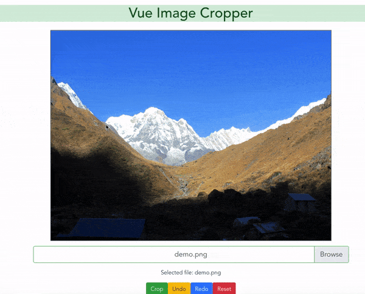

# vue-polygon-cropper
Vue polygon cropper lets you to crop image with any numbers of points with redo and undo functionality.

[](https://nodei.co/npm/vue-polygon-cropper/)




## Installation

```shell
npm install --save vue-polygon-cropper
```
or with yarn

```shell
yarn add vue-polygon-cropper
```

## Demo

Checkout here **[gobeam.github.io/vue-polygon-cropper/](https://gobeam.github.io/vue-polygon-cropper/)**

## Example

Full Example with implementation here **[Example](https://github.com/gobeam/vue-polygon-cropper/tree/master/example)**

## Usage

```vue
// Global
import Vue from 'vue';
import VuePolygonCropper from 'vue-polygon-cropper';
Vue.component(VuePolygonCropper);

// Local
import VueCropper from 'vue-polygon-cropper';
export default {
  components: { VueCropper}
}

...
     <template>
         <div id="app">
             <polygon-crop :imageSource="'/demo.png'" ref="canvas"></polygon-crop>
             <button @click.prevent="crop">Crop</button>
             <button @click.prevent="undo">Undo</button>
             <button @click.prevent="redo">Redo</button>
             <button @click.prevent="reset">Reset</button>
     
         </div>
     </template>
     <script>
     
     	export default {
     		name: 'App',
     		methods: {
     			crop: function () {
     				this.$refs.canvas.crop();
     			},
     			undo: function () {
     				this.$refs.canvas.undo();
     			},
     			redo: function () {
     				this.$refs.canvas.redo();
     			},
     			reset: function () {
     				this.$refs.canvas.reset();
     			}
     		}
     	};
     </script>
...
```

## Options

| Name         | Type    | Required | Description                                                       |
|--------------|---------|----------|-------------------------------------------------------------------|
| imageSource  | String  | required | Image url or base64 to load on canvas.                            |
| canvasClass  | String  | optional | Pass class to canvas to load your custom style.                   |
| wrapperClass | String  | optional | Pass class to div wrapper of canvas to load your custom style.    |
| pointerClass | String  | optional | Pass class to pointer to load your custom style and customize it. |
| showCanvas   | Boolean | optional | Default true but pass false in order to hide image canvas.        |
| showPointer  | Boolean | optional | Default true but pass false in order to hide pointers.            |
| width        | Number  | optional | Pass width to canvas.                                             |
| height       | Number  | optional | Pass height to canvas.                                            |


## Contributing
Pull requests are welcome. For major changes, please open an issue first to discuss what you would like to change.

Please make sure to update tests as appropriate.


## License

Released under the MIT License - see `LICENSE.txt` for details.
